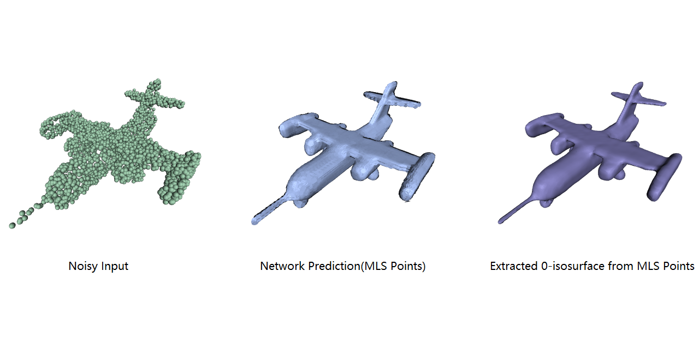

# DeepMLS: Deep Implicit Moving Least-Squares Functions for 3D Reconstruction

This repository contains the implementation of the paper:

**Deep Implicit Moving Least-Squares Functions for 3D Reconstruction**  
Shi-Lin Liu, Hao-Xiang Guo, [Hao Pan](https://haopan.github.io/), [Pengshuai Wang](https://wang-ps.github.io/), [Xin Tong](http://www.xtong.info/), [Yang Liu](https://xueyuhanlang.github.io/).  

<div style="text-align: center">

</div>


If you find our code or paper useful, please consider citing

```bibtex
@inproceedings{Liu2021MLS,
 author =  {Shi-Lin Liu, Hao-Xiang Guo, Hao Pan, Pengshuai Wang, Xin Tong, Yang Liu},
 title = {Deep Implicit Moving Least-Squares Functions for 3D Reconstruction},
 year = {2021}}
 ```

## Installation
First you have to make sure that you have all dependencies in place.
The simplest way to do so, is to use [anaconda](https://www.anaconda.com/). 

You can create an anaconda environment called `deep_mls` using
```
conda env create -f environment.yml
conda activate deep_mls
```
Next, we should compile the required customized tensorflow ops:  
#### [O-CNN](https://github.com/microsoft/O-CNN) Module 
For octree-based convolution module, please follow following steps to install:
```
cd Octree && git clone https://github.com/microsoft/O-CNN/
cd O-CNN/octree/external && git clone --recursive https://github.com/wang-ps/octree-ext.git
cd .. && mkdir build && cd build
cmake ..  && cmake --build . --config Release
export PATH=`pwd`:$PATH
cd ../../tensorflow/libs && python build.py --cuda /usr/local/cuda-10.0
cp libocnn.so ../../../ocnn-tf/libs
```

#### Efficient Neighbor Searching Ops
In this work, intensive neighbor search ops should be conducted, we provide an efficient neighbor search module:
```
cd points3d-tf/points3d
bash build.sh
```
In this step, some errors like this may occur:
```
tensorflow_core/include/tensorflow/core/util/gpu_kernel_helper.h:22:10: fatal error: third_party/gpus/cuda/include/cuda_fp16.h: No such file or directory
 #include "third_party/gpus/cuda/include/cuda_fp16.h"
```
For solving this, please refer to [issue](https://github.com/tensorflow/tensorflow/issues/31349).  Basically, We need to edit the codes in tensorflow framework, please modify 
``` C
#include "third_party/gpus/cuda/include/cuda_fp16.h"
```
in "site-packages/tensorflow_core/include/tensorflow/core/util/gpu_kernel_helper.h" to  
``` C
#include "cuda_fp16.h"
```
and
``` C
#include "third_party/gpus/cuda/include/cuComplex.h"
#include "third_party/gpus/cuda/include/cuda.h"
```
in "site-packages/tensorflow_core/include/tensorflow/core/util/gpu_device_functions.h" to
``` C
#include "cuComplex.h"
#include "cuda.h"
```

#### A Modified Marching Cubes Module
We have modified the [PyMCubes](https://github.com/pmneila/PyMCubes) to get a more efficient marching cubes method for extract 0-isosurface defined by mls points.  
To install:
```
git clone https://github.com/Andy97/PyMCubes
cd PyMCubes && python setup.py install
```

## Datasets
### ShapeNet

### Preprocessed Dataset
We have provided the processed tfrecords file. This can be used directly.

### Build the Dataset
If you want to build the dataset from your own data, please follow:  

#### Step 1: Get Watertight Meshes
To acquire a watertight version of ShapeNet, we first preprocess each mesh in ShapeNet. For each model in ShapeNet, we can get it's watertight version.
To get this, please follow the [preprocess steps](https://github.com/autonomousvision/occupancy_networks#Building-the-dataset) of [Occupancy Networks](https://github.com/autonomousvision/occupancy_networks).

#### Step 2: Get the groundtruth sdf pair
From step 1, we have already get the watertight version of each model. In this step, we utilize [OpenVDB](https://www.openvdb.org/) library to get the sdf values.   
For details, please refer to [here](vdb_tsdf).

## Usage

#### Inference using pre-trained model
We have provided pretrained models and we can inference using these models:
```
#first download the pretrained models
cd Pretrained && python download_models.py
#then we can use either of the pretrained model to do the inference
cd .. && python DeepMLS_Generation.py Pretrained/Config_d7_1p_pretrained.json --test
```

The input for the inference is defined in [here](https://github.com/Andy97/DeepMLS/blob/master/DeepMLS_Generation.py#L533).  
Your can replace it with other ply files in [examples](https://github.com/Andy97/DeepMLS/tree/master/examples) or your own data.

#### Extract Isosurface from MLS Points
Now we have network predicted mls points as well as its' radius. Now we can perform marching cubes to extract the mesh.
```
python mls_marching_cube.py --i examples/d0fa70e45dee680fa45b742ddc5add59.ply.xyz --o examples/d0fa70e45dee680fa45b742ddc5add59_mc.obj --scale
```

#### Training
Our code supports single and multiple gpu training. Please refer to the config json file.
```
python DeepMLS_Generation.py examples/Config_g2_bs32_1p_d6.json
```
